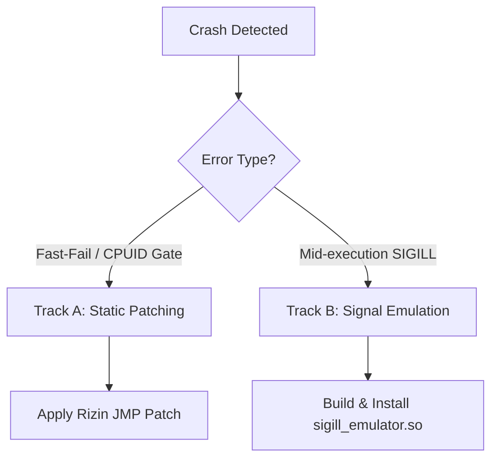

# AI Agent Integration Guide (`AGENTS.md`)

This guide explains how agentic AI coding assistants (like Antigravity or OpenCode agents) can load, parse, and execute the CPU compatibility playbooks in this repository, structured from high-level concepts to low-level execution schemas.

---

## 🟢 Novice Level: What is an Agentic Playbook?

### 1. The Core Concept
If you are an AI assistant helping a user write code, you have massive general knowledge, but you might lack the specific context of this system's hardware constraints. 

This repository includes [SKILL.md](./SKILL.md), which is a **playbook** or **skill** designed to be read by AI coding agents. Reading this file immediately teaches you how to diagnose, patch, and run compiled x86 binaries (like `agy`) on CPUs that lack modern hardware extensions (like AES-NI).

### 2. High-Level Agent Workflow
When a user tells you their program crashed with `Illegal instruction` or a startup validation error:
1. Locate and read the [SKILL.md](./SKILL.md) file.
2. Follow the step-by-step diagnostic commands in the skill to find the crash site.
3. Apply the dynamic preloader or static patch.

---

## 🟡 Developer Level: Staging and Deciding Workflows

AI agents should structure their execution steps depending on the type of error encountered in process execution logs.



### 1. Track A: Static Patching
If the binary aborts during initialization via a CPUID-check before execution reaches the program hotpaths, the agent must statically patch the check instructions using `rizin`.

### 2. Track B: Signal Emulation
If the binary fails mid-execution during performance-critical cryptographic or hashing loops, the agent must compile and install the `sigill_emulator.so` preloader.

---

## 🔴 Expert Level: Script-Based Automation and FFI Schemas

Below is the low-level execution schema for agents to run analysis, patching, and compilation checks.

### 1. Automated Analysis Script
Agents can run the Capstone parser in non-interactive python subprocesses via `uv run` to inspect bytes at target offsets:
```bash
uv run python3 -c '
from capstone import *
import sys
with open("/path/to/binary", "rb") as f:
    f.seek(file_offset)
    code = f.read(32)
md = Cs(CS_ARCH_X86, CS_MODE_64)
for insn in md.disasm(code, crash_address):
    print(f"0x{insn.address:x}: {insn.mnemonic} {insn.op_str} bytes={insn.bytes.hex()}")
'
```

### 2. Non-Interactive Rizin Patch Scripting
To automate static patching without manual console inputs, agents should feed commands to `rizin` using the `-c` argument:
```bash
# Verify byte content before write
rizin -c "s <patch_offset>; px 6" /path/to/binary

# Write relative jump in write mode (-w) and quit
rizin -w -c "s <patch_offset>; wx e9b300000090; q" /path/to/binary
```

### 3. Verification Commands
Agents must verify compilation and target execution using standard shell exit code validation:
```bash
# Rebuild emulator
make clean && make

# Preload target and run help check
LD_PRELOAD=./sigill_emulator.so /path/to/binary --help
```
If the command exits with `0`, the emulation is correct. If it exit-codes with `132` (SIGILL), the opcode is missing from the emulator's decode lists.
